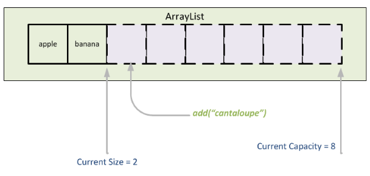

Programming assignment 4 (PA04)
===============================

# Array-based List (std::vector)
---

## What is this repository?
The files listed here are the starting point for your assignment.
Only add source files, like `pa04.cpp` (not compiled files, e.g. `a.out`), to the Git repository.

## Note (actuall do this)!!
Thoroughly read the Canvas page [How to: Homework Submissions](https://mst.instructure.com/courses/51336/pages/how-to-homework-submissions) for good tips, tricks, hints, and instructions on programming assignments, including how to submit via Git.

* Remember, only cpp files should be compiled, not h or hpp, and never include a cpp file via #include.

## Assignment description
Mimic the std::vector behavior with your array-based list implementation. When implementing your list, you must use a **dynamic array**, and you are expected to use the **same names and declarations** as defined by the STL implementation of an array list, the **vector** (checkout the resources listed below). Make sure that you read the detailed instruction and description for each function in the header file carefully. 

Don't forget that the vector
you implement must be **templated** on the data type it stores, too.

### Background reading and resources:
* Lecture notes 08a and the sample lecture codes
* Vector
  * http://en.cppreference.com/w/cpp/container/vector (the more official source)
  * http://www.cplusplus.com/reference/vector/vector/ (may also help)
* Overloading operator syntax
  * https://en.cppreference.com/w/cpp/language/operators

## Input/Output
Given only indirectly this time. The sample input and output are defined in
terms of the behavior of the std::vector (which you must fully test yourself).

## Grading
This assignment will be graded based on the successful implementation of the functions in the header file using unit testing, and the correct output of main (if applicable). Each function's performance on its own unit test will be worth a certain subset of those points. A correct submission will result in a grade of 100%. Besides program correctness, you should ensure that your work maintains a high standard in code readability and documentation (i.e. all code should be well-commented).

### Compilation
As a hard rule, any program that does not compile will receive an automatic grade of 10% of the total mark.

## Due date
Please see the canvas assignment schedule for all due dates.
