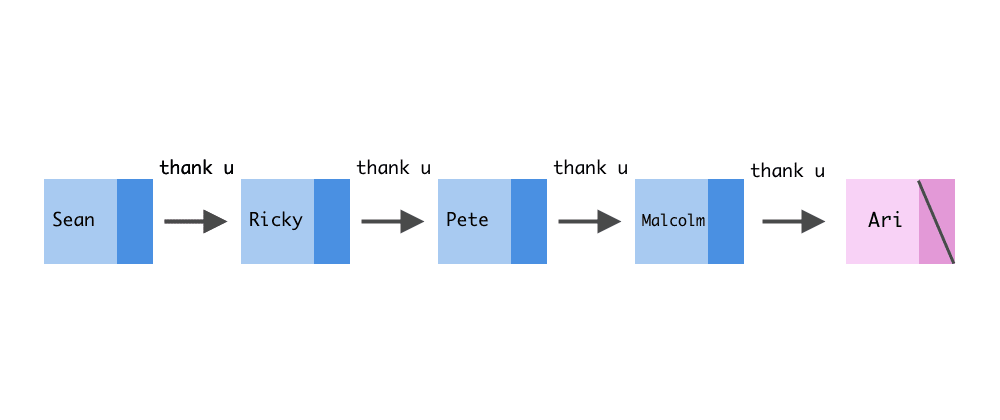

Programming assignment 5 (PA05)
===============================

# Linked list (std::list)
---

## What is this repository?
The files listed here are the starting point for your assignment.
Only add source files, like `pa05.cpp` (not compiled files, e.g. `a.out`), to the Git repository.

## Note (actuall do this)!!
Thoroughly read the Canvas page [How to: Homework Submissions](https://mst.instructure.com/courses/51336/pages/how-to-homework-submissions) for good tips, tricks, hints, and instructions on programming assignments, including how to submit via Git.

## Assignment description
Mimic the **std::list** behavior with your MyList (must use a **doubly linked list**). In addition, you must use exactly ONE (not two) sentinel/dummy node (to which the m_sentinel pointer points), which is linked to the last and first elements of the list at all times. This is different than the DLL example that had been shown in class which used two sentinel nodes (one for the head and one for the tail). Using the sentinel node in this case should still provide you the convenience of simplifying the *insert*, *append*, and *remove* methods by eliminating all need for special-case code when the list is empty, or when inserting at the head or tail of the list.

* General container library information
  * https://en.cppreference.com/w/cpp/container
  * http://www.cplusplus.com/reference/stl/
* List
  * https://en.cppreference.com/w/cpp/container/list (the more official source)
  * http://www.cplusplus.com/reference/list/list/ (may also help)
* Various DLList implementations (ebooks on Canvas/Syllabus)
  * Data Structures and Algorithm Analysis (Clifford A. Shaffer) - Ch. 3.4
  * Efficient Data Structures (Taylor) - Ch. 3.2
* Overloading operator syntax
  * https://en.cppreference.com/w/cpp/language/operators

## Input/Output
Given only indirectly this time.The sample input and output are defined in
terms of the behavior of the std::list (which you must fully test yourself).

## Grading
This assignment will be graded based on the successful implementation of the functions in the header file using unit testing, and the correct output of main (if applicable). Each function's performance on its own unit test will be worth a certain subset of those points. A correct submission will result in a grade of 100%. Besides program correctness, you should ensure that your work maintains a high standard in code readability and documentation (i.e. all code should be well-commented).

### Compilation
As a hard rule, any program that does not compile will receive an automatic grade of 10% of the total mark.

## Due date
Please see the schedule on Canvas for all due dates.
